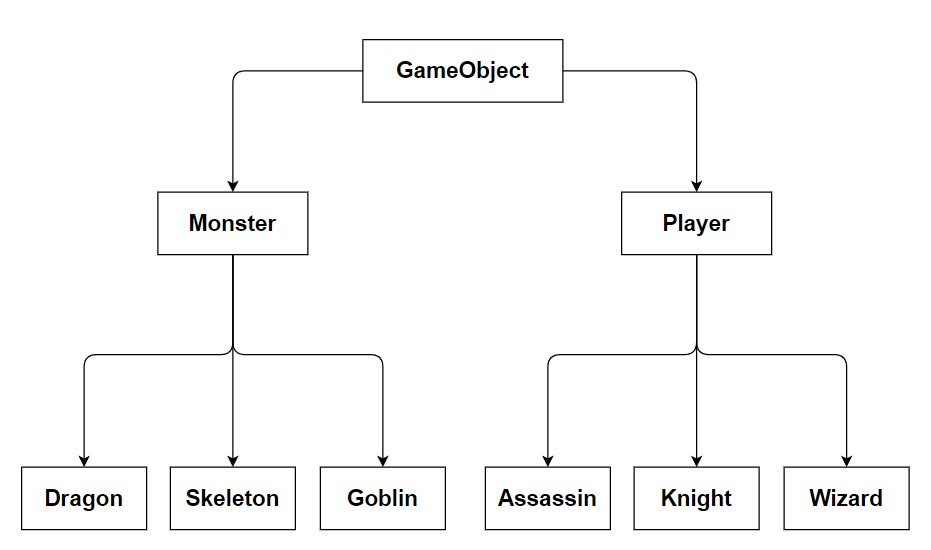

In this project you are tasked with developing the basis for a text-based role-playing game. 
You'll be creating a hierarchy of classes which will ultimately become assets for your game. 

Players should be able to choose between different character classes and then fight various 
monster types. Players and monsters will each have unique abilities based on their type, such as 
a dragon breathing fire or a wizard casting a healing spell. Each entity in the game has a 
number of stats as well, such as health points or attack power.

## Tasks 📝

### Step 0: Fork
Fork this repository and clone it to your local machine. Create a new branch named
  `develop` and switch to it.

### Step 1: Set up class hierarchies

You must implement the inheritance hierarchy displayed in the image above. **Hint**: Remember 
Use the correct inheritance keyword for each file type.

### Step 2: Implement the provided classes and add attributes to them

Below you can find a list of all the classes you must implement. It is up to you to determine 
the datatype for each attribute and how to declare each method. You can add more variables, 
methods, and classes where you see fit.

- **GameObject**:  Each entity in the game is called a Game Object. That three  methods declared 
  in this Interface are used by both monsters and players.  
  - `attack()` is called whenever an entity wants to attack another entity (target) with
    their base attack power. This attack function is separate from the special abilities 
    different classes may have.
  - `takeDamage()` is called whenever an entity takes damage from another one, reducing their 
    health points by the amount of damage received.
  - `die()` is called when an entity's health reaches 0.  

- **Monster**:  Each monster must have the following attributes: `health`, `attackPower`.
   You can add `isAlive` as an attribute to keep track of a monster's current state. A
  similar attribute can be defined for the player class.  **Hint**: Even though `Monster` is an 
  abstract class, you can implement methods in it. These methods can later be used or overridden
  by its subclasses.  

  - **Goblin**: The Goblin class is the most basic enemy type encountered in the game. It has no
    unique attributes or abilities. It can only deal damage to players  via basic attacks.  
  - **Dragon**: The dragon monster class has the special ability to breathe fire. Using this 
    ability damages multiple players simultaneously. You must define a `fireDamage` attribute to 
    determine the fire attack's damage.  
  - **Skeleton**: The Skeleton class has the unique ability to revive itself after dying (only
    once), resetting its health back to the full amount. You can implement this in multiple ways,
    one method would be to create a `deathCount` attribute to keep track of its deaths.   

- **Player**:  Each player must have the following attributes; `health`, `attackPower`, 
  `playerName`. **Hint**: Even though `Player` is an abstract class, you can implement 
  methods in it. These methods can later be used or overridden by its subclasses.  

  - **Assassin**: This character class is focused on stealth and dealing critical damage, so it 
    must have the unique attributes `isInvisible` and `criticalMultiplier`. The 
    assassin has the ability to go invisible. Attacking while invisible breaks the invisibility 
    but deals a critical hit, dealing extra damage (attackPower * criticalMultiplier).  
  - **Knight**: This character class focuses on damage reduction and blocking attacks. You must 
    define the unique attribute `armor`. Any damage the knight receives is reduced by the amount 
    of armor it has. **Hint**: You must override the `takeDamage()` method and reduce the damage
    done based on the knight's armor value. Optional: The Knight can also use the 
    ability to block incoming attacks, halving the damage received while blocking. You must 
    define the attribute `isBlocking` for this purpose.  
  - **Wizard**: (Optional) This character class focuses on casting spells to either damage 
    enemies or heal allies. You must define the following unique attributes for it:
    `mana`, `healSpellPower`, `healSpellCost`, `damageSpellPower`, `damageSpellCost`  The 
    wizard can use mana to cast spells. Each spell has a mana cost and a power. Casting 
    the healing spell will heal a chosen player based on the spell's power. Casting the damaging 
    spell damages an enemy based on the spell's power. The wizard should not be able to cast 
    spells if it doesn't have enough mana.  

**Pro Tip**: Don't Repeat Yourself (DRY). Use inheritance to implement methods in the parent 
classes and only override them where necessary.

**Note**: Every time a player or a monster performs an action, you should print the action's
corresponding message in the terminal. For example, if a player uses a basic attack against a
monster it could be:
  Gholi attacked Dragon! Dragon took 25 damage!
 Dragon has 75 health

### Step 3: Build instances of the various classes you made
Use what you've learned of inheritance and polymorphism to create instances of player and 
monster classes and test them. You can create a list of all game objects, or a list of all 
players and a list of all monsters. You can `App.java` for this purpose. You are allowed to 
change all the code in this class.

### Step 4: Use the player and monster classes to create a game! 
Allow users to create a character and choose their class, then randomly generate monsters for 
the player to fight. You should also design a menu for 
Here are a few ideas for a more complex combat system:
  - Allow users to create multiple characters and send all of them (as a party) to fight monsters.
  - Create new monster and character classes to diversify the combat encounters.
  - Implement a dice-rolling system (like a D20) to add some elements of randomness to fights.
  - Build a PvP game mode where two players can combat each other.
  You are in charge of designing the game using the available tools, so get creative!

#### Bonus:
You can add more attributes to the existing classes, such as experience points, levels, gold, loot, 
weapons, spells, merchants, etc.
